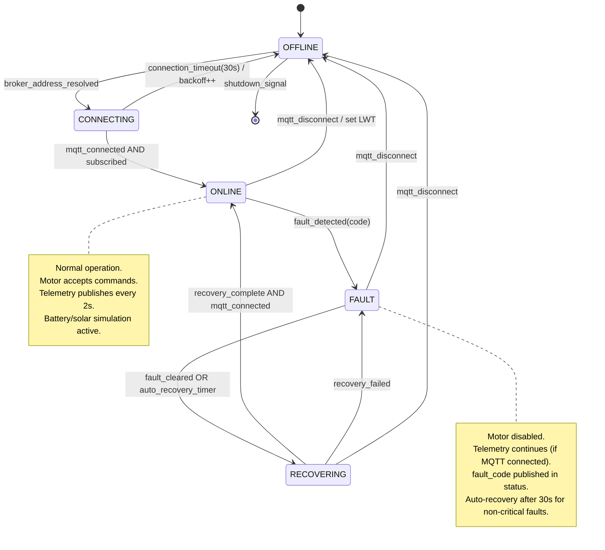
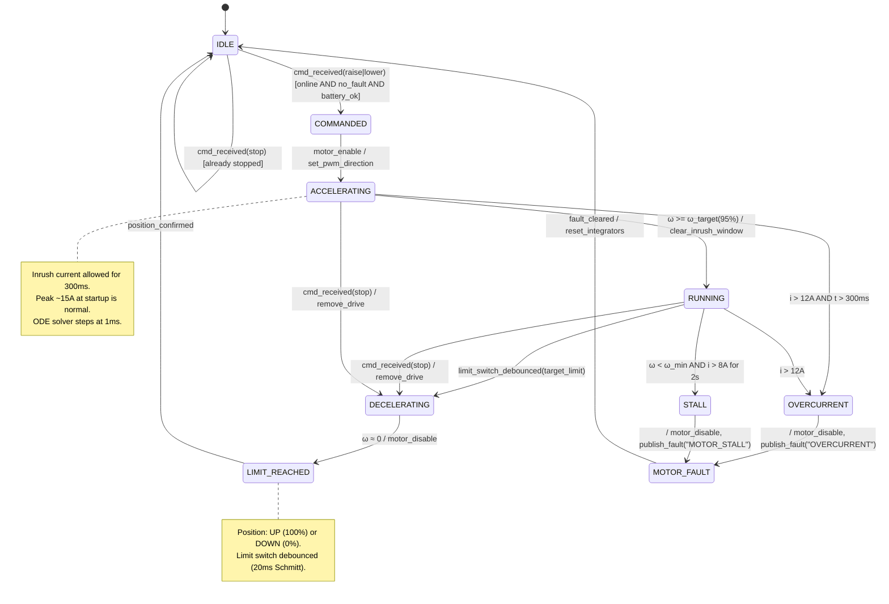
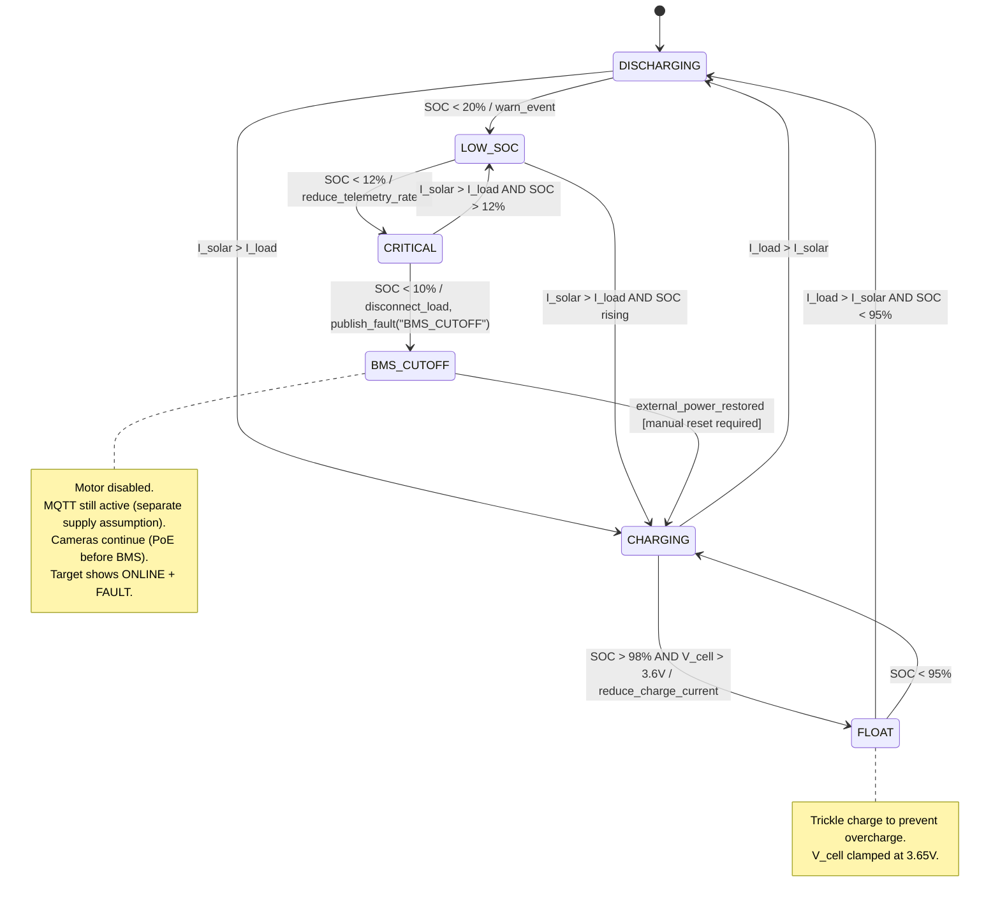
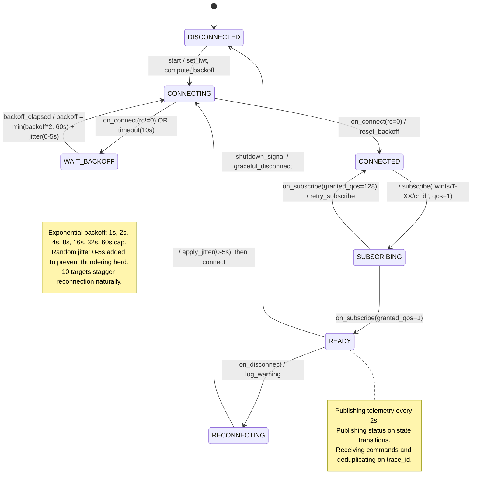
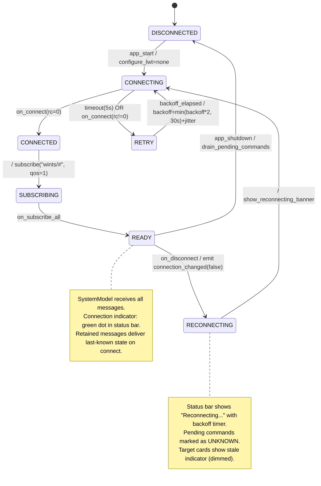

# WINTS — System Design Document
## Document ID: 01_design
## Version: 1.0 | Date: 2026-06-14
## Classification: Engineering Design — CEP Deliverable

---

## 1. System Decomposition

### 1.1 Component Inventory

| Component | Process | Language | Interface | Failure Modes |
|-----------|---------|----------|-----------|---------------|
| **Mosquitto Broker** | Native binary | C | TCP :1883 | Crash, port conflict, disk full (persistence), session leak |
| **Target Simulator** | Python asyncio | Python 3.11 | MQTT pub/sub, HTTP :9301-9310 | ODE divergence, asyncio starvation, MQTT disconnect, state corruption |
| **Control Room Dashboard** | PyQt6 GUI | Python 3.11 | MQTT pub/sub, RTSP consume, HTTP :9200 | Event loop block, thread deadlock, video pipeline leak, broker disconnect |
| **MediaMTX RTSP Server** | Native binary | Go | RTSP :8554 | Binary missing, port conflict, source file corrupt, stream hang |
| **Video Generator** | FFmpeg subprocess | C/Python | File I/O | FFmpeg not found, disk full, codec unsupported |
| **CLI Orchestrator** | Python Click | Python 3.11 | stdin/stdout | Subprocess crash, orphan processes, path resolution |

### 1.2 Component Interfaces

```
┌─────────────────────────────────────────────────────────────────┐
│                         OPERATOR                                │
│                           │                                     │
│                     ┌─────▼──────┐                              │
│                     │  PyQt6 GUI │                              │
│                     │  (MainWin) │                              │
│                     └─────┬──────┘                              │
│                           │ Qt Signals                          │
│              ┌────────────┼────────────────┐                    │
│         ┌────▼────┐  ┌────▼─────┐  ┌──────▼──────┐            │
│         │ Target  │  │  Event   │  │   Metrics   │            │
│         │  Cards  │  │   Log    │  │   Panel     │            │
│         └────┬────┘  └──────────┘  └─────────────┘            │
│              │ read-only                                        │
│         ┌────▼──────────────────┐                              │
│         │    SystemModel        │◄── single source of truth    │
│         │  Dict[str,TargetState]│                              │
│         └────┬──────────────────┘                              │
│              │ QMetaObject.invokeMethod (thread-safe)           │
│         ┌────▼──────┐                                          │
│         │MQTTClient │─── background thread ──► Mosquitto:1883  │
│         └───────────┘                                          │
│                                                                 │
│  ┌───────────────────┐    ┌──────────────────────────┐         │
│  │ CommandTracker     │    │ Prometheus /metrics:9200 │         │
│  │ UUID→pending/ack   │    │ text/plain exposition    │         │
│  └───────────────────┘    └──────────────────────────┘         │
└─────────────────────────────────────────────────────────────────┘

                    MQTT :1883 (TCP)
                        │
┌───────────────────────┼──────────────────────────────────┐
│            TARGET SIMULATOR (10 asyncio tasks)           │
│                       │                                   │
│  ┌────────────────────▼────────────────────┐             │
│  │      TargetSimulator (per target)       │             │
│  │  ┌──────────┐ ┌──────────┐ ┌────────┐  │             │
│  │  │ Motor ODE│ │ Battery  │ │ Solar  │  │             │
│  │  │ solve_ivp│ │ Coulomb  │ │ MPPT   │  │             │
│  │  └──────────┘ └──────────┘ └────────┘  │             │
│  │  ┌──────────┐ ┌──────────────────────┐  │             │
│  │  │ RF Link  │ │ State Machine (HSM)  │  │             │
│  │  │ FSPL+PER │ │ OFFLINE→ONLINE→FAULT │  │             │
│  │  └──────────┘ └──────────────────────┘  │             │
│  └─────────────────────────────────────────┘             │
│                                                           │
│  ┌─────────────────────────────────┐                     │
│  │ Fault Injector HTTP :9301-9310  │                     │
│  │ POST /fault/inject              │                     │
│  │ POST /fault/clear               │                     │
│  │ GET  /state                     │                     │
│  └─────────────────────────────────┘                     │
│                                                           │
│  ┌─────────────────────────────────┐                     │
│  │ Prometheus /metrics :9101-9110  │                     │
│  └─────────────────────────────────┘                     │
└──────────────────────────────────────────────────────────┘

                    RTSP :8554
                        │
┌───────────────────────┼──────────────────┐
│       MediaMTX (native binary)           │
│  20 paths: /target-{01..10}-{front|rear} │
│  Source: video_server/samples/*.mp4 loop │
└──────────────────────────────────────────┘
```

### 1.3 Data Flow

1. **Command flow** (operator → target):
   ```
   Button click → CommandTracker.issue(target_id, cmd)
                → MQTTClient.publish("wints/T-XX/cmd", payload, qos=1)
                → Mosquitto broker
                → Target MQTT subscriber
                → State machine processes command
                → Motor ODE begins integration
                → Status published to "wints/T-XX/status"
                → Mosquitto broker
                → Dashboard MQTTClient receives
                → QMetaObject.invokeMethod → SystemModel.update()
                → Qt signal → TargetCard updates UI
                → CommandTracker marks ack
   ```

2. **Telemetry flow** (target → dashboard):
   ```
   Physics tick (every 1ms) → accumulate
   Telemetry timer (every 2s) → collect readings
                              → RF model: compute PER
                              → if random() > PER: publish
                              → "wints/T-XX/telemetry" qos=0
                              → Mosquitto → Dashboard
   ```

3. **Fault detection flow**:
   ```
   Motor overcurrent (i > 12A for >300ms)
   OR BMS cutoff (SOC < 10%)
   OR limit switch stuck (both active)
   OR external injection (HTTP POST /fault/inject)
   → State machine → FAULT state
   → Publish status with fault_code
   → Dashboard: badge goes red, fault chip appears
   → Event log: red entry with fault details
   ```

---

## 2. State Machines

### 2.1 Target Lifecycle



### 2.2 Motor Controller



### 2.3 Battery Manager



### 2.4 MQTT Client (per target)



### 2.5 Dashboard Connection Manager



---

## 3. Timing Budget

### 3.1 End-to-End Command Latency

```
Operator clicks "Raise T-01"
│
├─ PyQt6 event loop dispatch .............. ≤ 5 ms
│   (signal/slot, CommandTracker.issue)
│
├─ MQTT publish (QoS 1) .................. ≤ 10 ms
│   (paho client thread → TCP write)
│
├─ Mosquitto broker queuing ............... ≤ 2 ms
│   (receive → route → deliver to subscriber)
│
├─ Simulated network jitter ............... 0–50 ms
│   (RF model delay injection, mean ~15 ms)
│
├─ Target MQTT subscriber receive ......... ≤ 5 ms
│   (paho on_message callback)
│
├─ Pydantic validation + dedup check ...... ≤ 2 ms
│
├─ State machine transition processing .... ≤ 1 ms
│   (IDLE → COMMANDED → ACCELERATING)
│
├─ First motor ODE step ................... 1 ms
│   (solve_ivp single step, motor begins moving)
│
├─ Status publish (QoS 1) ................ ≤ 10 ms
│
├─ Mosquitto broker → Dashboard ........... ≤ 2 ms
│
├─ Dashboard receive + validate ........... ≤ 5 ms
│
├─ SystemModel update + Qt signal ......... ≤ 2 ms
│
├─ TargetCard repaint ..................... ≤ 5 ms
│
└─ CommandTracker marks ACK ............... ≤ 1 ms

TOTAL (typical): ~60–110 ms
TOTAL (worst case, no packet loss): ~150 ms
TIMEOUT THRESHOLD: 500 ms (includes one MQTT QoS 1 retry)
```

### 3.2 Telemetry Update Cycle

```
Physics tick ............................ every 1 ms (motor ODE)
Battery/solar update ................... every 100 ms (sim-time adjusted)
RF RSSI recalculation .................. every 1 s
Telemetry MQTT publish ................. every 2 s (QoS 0)
Dashboard chart refresh ................ every 1 s (pyqtgraph)
Status MQTT publish .................... on state transition only (QoS 1, retained)
```

---

## 4. Physical Models

### 4.1 DC Motor (Permanent Magnet, 12V/10A Geared)

**Governing equations (coupled ODEs):**

```
Electrical circuit:
    V_bus = L · (di/dt) + R · i + K_e · ω

    Rearranged for ODE solver:
    di/dt = (V_bus - R · i - K_e · ω) / L

Mechanical system:
    J · (dω/dt) = K_t · i - B · ω - T_load · sign(ω)

    Rearranged for ODE solver:
    dω/dt = (K_t · i - B · ω - T_load · sign(ω)) / J

Position integration:
    dθ/dt = ω
    position_pct = (θ / θ_max) × 100
    θ_max = π/2 (90° rotation from DOWN to UP)
```

**Constants (sourced from typical 12V DC geared motor datasheet):**

| Constant | Symbol | Value | Unit | Source |
|----------|--------|-------|------|--------|
| Armature resistance | R | 0.5 | Ω | Datasheet typical |
| Armature inductance | L | 2.0 | mH | Datasheet typical |
| Torque constant | K_t | 0.08 | N·m/A | K_t = K_e for PMDC |
| Back-EMF constant | K_e | 0.08 | V·s/rad | Matched to K_t |
| Rotor inertia + load | J | 0.02 | kg·m² | Estimated: target plate ~5kg at 0.5m |
| Viscous friction | B | 0.01 | N·m·s/rad | Typical for geared motor |
| Load torque | T_load | 2.0 | N·m | Gravity + friction at worst angle |
| Overcurrent threshold | I_oc | 12.0 | A | BTS7960 sense pin limit |
| Inrush window | t_inrush | 300 | ms | Allow startup spike |
| Stall detection | ω_stall | 0.5 | rad/s | Below this + high current = stall |

**Limit switch model:**
```
Physical bounce: Poisson-distributed train of 3-8 transitions
  Duration per bounce: uniform(5, 50) ms
  Total bounce window: 5-200 ms (but typically 20-80 ms)

Software debounce (Schmitt trigger):
  Debounce period: 20 ms
  Logic: switch considered stable after 20 ms of consistent reading
  Implementation: timer reset on each transition, output updates only when timer expires
```

**Solver configuration:**
- Method: `scipy.integrate.solve_ivp` with RK45 (Runge-Kutta 4th/5th order)
- Max step: 1 ms
- Absolute tolerance: 1e-8
- Relative tolerance: 1e-6
- State vector: [i, ω, θ] (current, angular velocity, angle)

### 4.2 Battery (LiFePO4 12V 100Ah, 4S configuration)

**SOC by coulomb counting:**
```
dSOC/dt = -I_net / (C_nominal × η_coulombic × 3600)

Where:
  I_net = I_motor + I_electronics - I_solar_charge  [A]
  C_nominal = 100  [Ah]
  η_coulombic = 0.995  (round-trip efficiency)
  Factor 3600 converts Ah to As
```

**Terminal voltage:**
```
V_terminal = N_series × OCV(SOC) - I_net × R_internal(T)

Where:
  N_series = 4  (4S pack)
  R_internal = R_base × f_temperature(T)
  R_base = 0.005 Ω (5 mΩ per cell, 20 mΩ pack)
```

**OCV-SOC lookup table (LiFePO4, per cell, from EVE LF100LA datasheet):**

| SOC (%) | OCV (V/cell) | Pack V (4S) |
|---------|-------------|-------------|
| 0 | 2.50 | 10.00 |
| 5 | 3.00 | 12.00 |
| 10 | 3.20 | 12.80 |
| 15 | 3.23 | 12.92 |
| 20 | 3.25 | 13.00 |
| 30 | 3.27 | 13.08 |
| 40 | 3.28 | 13.12 |
| 50 | 3.30 | 13.20 |
| 60 | 3.31 | 13.24 |
| 70 | 3.33 | 13.32 |
| 80 | 3.35 | 13.40 |
| 90 | 3.40 | 13.60 |
| 95 | 3.50 | 14.00 |
| 100 | 3.65 | 14.60 |

*Interpolation: linear between table entries.*

**Temperature derating of R_internal:**

| Temperature (°C) | R_internal multiplier |
|-------------------|-----------------------|
| -20 | 2.00 |
| -10 | 1.60 |
| 0 | 1.30 |
| 10 | 1.10 |
| 25 | 1.00 |
| 40 | 0.90 |
| 55 | 0.95 (aging effects) |

**BMS protection:**
- Hard cutoff: SOC < 10% → disconnect motor load
- Over-voltage: V_cell > 3.7V → stop charging
- Under-voltage: V_cell < 2.5V → emergency shutdown
- Over-temperature: T > 60°C → reduce charge rate to 50%

**Quiescent loads (always on):**
- Electronics (MCU, radio, sensors): 2W constant
- Camera system (2× IP cameras via PoE): 15W when streaming, 5W standby
- Total baseline: ~7W average

### 4.3 Solar Panel (200W, Monocrystalline)

**Irradiance model:**
```
G(t) = G_peak × max(0, sin(π × (t_sim - t_sunrise) / (t_sunset - t_sunrise)))
       + N(0, σ_cloud²)

Where:
  G_peak = 1000 W/m²  (standard test conditions)
  t_sunrise = 6.0 h  (06:00 sim time)
  t_sunset = 18.0 h  (18:00 sim time)
  σ_cloud = 50 W/m²  (Gaussian cloud variation)
  G(t) is clamped to [0, G_peak]  (no negative irradiance)
```

**Panel electrical output:**
```
P_solar = η_panel × A_panel × G(t) × η_mppt

Where:
  η_panel = 0.22  (22% panel efficiency, modern monocrystalline)
  A_panel = 1.0 m²  (physical panel area)
  η_mppt = 0.95  (MPPT tracking efficiency)
  P_max = 0.22 × 1.0 × 1000 × 0.95 = 209 W peak

Charging current:
  I_charge = min(P_solar / V_terminal, I_charge_max)
  I_charge_max = 20A  (0.2C for 100Ah, safe continuous)
```

**Time domain:**
- Solar runs in **simulated time** (accelerated by `time_acceleration_factor`)
- Default: 60× → 1 real minute = 1 simulated hour
- At 60×: a full 12-hour solar day passes in 12 real minutes

### 4.4 RF Link (5 GHz 802.11n, Ubiquiti airMAX-style)

**Free-space path loss:**
```
FSPL(dB) = 20 × log10(d_m) + 20 × log10(f_Hz) + 20 × log10(4π/c)

Simplified for 5 GHz:
FSPL(dB) = 20 × log10(d_m) + 20 × log10(5e9) + 20 × log10(4π/3e8)
         = 20 × log10(d_m) + 194.47 + (-27.56)
         ≈ 20 × log10(d_m) + 126.9  [for d in meters]

For d = 1 km:  FSPL ≈ 126.9 + 60 = 186.9 dB  — unrealistic for isotropic
With high-gain antennas: this is compensated by G_tx and G_rx
```

**Link budget:**
```
RSSI(dBm) = P_tx + G_tx + G_rx - FSPL - L_shadow - L_misc

Where:
  P_tx = 23 dBm  (200 mW, typical airMAX)
  G_tx = 16 dBi  (sector antenna at control room)
  G_rx = 23 dBi  (dish at target, typical NanoBeam)
  L_misc = 3 dB  (cable losses, connector losses, fade margin)
  L_shadow ~ N(0, σ_shadow²),  σ_shadow = 6 dB
```

**Target positions (simulated):**

| Target | Distance (m) | Bearing (°) | Nominal RSSI (dBm) |
|--------|-------------|-------------|---------------------|
| T-01 | 500 | 10 | -52.8 |
| T-02 | 1200 | 35 | -60.5 |
| T-03 | 2500 | 80 | -67.0 |
| T-04 | 800 | 120 | -56.9 |
| T-05 | 3500 | 160 | -69.9 |
| T-06 | 1800 | 200 | -64.0 |
| T-07 | 4200 | 240 | -71.4 |
| T-08 | 600 | 280 | -54.5 |
| T-09 | 5000 | 310 | -72.9 |
| T-10 | 1500 | 350 | -62.4 |

**Packet Error Rate from RSSI:**
```
if RSSI > -65 dBm:
    PER = 0.0
elif -80 <= RSSI <= -65:
    PER = 0.3 × ((-65 - RSSI) / 15)  # linear 0→0.3
elif -95 <= RSSI < -80:
    PER = 0.3 + 0.7 × ((-80 - RSSI) / 15)  # linear 0.3→1.0
else:
    PER = 1.0  # total loss
```

**Fading events:**
- Once per simulated hour, a random target experiences 30 seconds of increased shadowing
- During fading: σ_shadow doubles from 6 to 12 dB
- Effect: RSSI drops 6-12 dB, PER spikes, telemetry gaps appear

---

## 5. MQTT Contract

### 5.1 Topic Map

| Direction | Topic | QoS | Retain | Rate | Purpose |
|-----------|-------|-----|--------|------|---------|
| Operator → Target | `wints/T-{XX}/cmd` | 1 | false | On demand | Raise/lower/stop commands |
| Operator → All | `wints/broadcast/cmd` | 1 | false | On demand | Broadcast commands |
| Target → Operator | `wints/T-{XX}/status` | 1 | **true** | On state change | Current target state |
| Target → Operator | `wints/T-{XX}/telemetry` | 0 | false | Every 2s | Physics readings |
| Broker (LWT) | `wints/T-{XX}/status` | 1 | **true** | On disconnect | Offline notification |

### 5.2 Payload Schemas

**Command payload** (`wints/T-{XX}/cmd` and `wints/broadcast/cmd`):
```json
{
  "$schema": "http://json-schema.org/draft-07/schema#",
  "type": "object",
  "required": ["trace_id", "cmd", "ts"],
  "properties": {
    "trace_id": {
      "type": "string",
      "format": "uuid",
      "description": "Unique command identifier for tracking and deduplication"
    },
    "cmd": {
      "type": "string",
      "enum": ["raise", "lower", "stop"],
      "description": "Target movement command"
    },
    "ts": {
      "type": "integer",
      "description": "Unix timestamp in milliseconds"
    }
  },
  "additionalProperties": false
}
```

**Status payload** (`wints/T-{XX}/status`):
```json
{
  "$schema": "http://json-schema.org/draft-07/schema#",
  "type": "object",
  "required": ["target_id", "online", "position", "position_pct", "battery_soc",
               "battery_voltage", "fault", "fault_code", "trace_id", "ts"],
  "properties": {
    "target_id": {"type": "string", "pattern": "^T-\\d{2}$"},
    "online": {"type": "boolean"},
    "position": {"type": "string", "enum": ["UP", "DOWN", "MOVING"]},
    "position_pct": {"type": "number", "minimum": 0, "maximum": 100},
    "battery_soc": {"type": "number", "minimum": 0, "maximum": 100},
    "battery_voltage": {"type": "number"},
    "fault": {"type": "boolean"},
    "fault_code": {
      "type": ["string", "null"],
      "enum": [null, "OVERCURRENT", "BMS_CUTOFF", "LIMIT_STUCK", "MOTOR_STALL"]
    },
    "trace_id": {"type": ["string", "null"]},
    "ts": {"type": "integer"}
  }
}
```

**Telemetry payload** (`wints/T-{XX}/telemetry`):
```json
{
  "$schema": "http://json-schema.org/draft-07/schema#",
  "type": "object",
  "required": ["target_id", "rssi_dbm", "packet_loss_pct", "uptime_s",
               "motor_current_a", "solar_w", "temperature_c", "sim_time_h", "ts"],
  "properties": {
    "target_id": {"type": "string", "pattern": "^T-\\d{2}$"},
    "rssi_dbm": {"type": "integer"},
    "packet_loss_pct": {"type": "number", "minimum": 0, "maximum": 100},
    "uptime_s": {"type": "integer"},
    "motor_current_a": {"type": "number", "minimum": 0},
    "solar_w": {"type": "number", "minimum": 0},
    "temperature_c": {"type": "number"},
    "sim_time_h": {"type": "number", "minimum": 0},
    "ts": {"type": "integer"}
  }
}
```

**LWT payload** (published by broker on target disconnect):
```json
{
  "target_id": "T-XX",
  "online": false,
  "position": "UNKNOWN",
  "position_pct": -1,
  "battery_soc": -1,
  "battery_voltage": -1,
  "fault": true,
  "fault_code": null,
  "trace_id": null,
  "ts": 0
}
```

### 5.3 Failure Semantics

| Failure | Receiver Action |
|---------|----------------|
| Malformed JSON | Log at ERROR with raw payload; increment `wints_malformed_payload_total`; discard. Never crash. |
| Pydantic validation failure | Log at ERROR with field details; increment counter; discard. |
| Unknown `cmd` value | Log at WARNING; respond with status (no state change). |
| Out-of-order delivery | Ignore — commands are idempotent (raise when already UP = no-op). |
| Duplicate (QoS 1 redeliver) | Deduplication on `trace_id` with 5-second LRU window (max 200 entries). Log at DEBUG "duplicate command suppressed". |
| Retained stale message | Dashboard accepts retained messages on connect; marks them with `is_retained=true` in SystemModel; does not trigger command ack. |
| Empty payload | Log at WARNING "empty payload on topic X"; discard. |

### 5.4 Broadcast Semantics

When a command arrives on `wints/broadcast/cmd`:
- Each target treats it identically to a direct command
- Each target generates: `child_trace_id = trace_id + "." + target_id`
- Dashboard receives 10 individual status updates, each with the child_trace_id
- CommandTracker tracks the broadcast trace_id and expects 10 acks

---

## 6. Observability Plan

### 6.1 Structured Logging

**Format:** One JSON object per line (structlog with JSONRenderer)

```json
{
  "timestamp": "2026-06-14T14:30:15.123456Z",
  "level": "info",
  "component": "target_simulator",
  "target_id": "T-03",
  "trace_id": "a1b2c3d4-e5f6-7890-abcd-ef1234567890",
  "event": "command_received",
  "payload": {"cmd": "raise"},
  "duration_ms": null,
  "logger": "target_simulator.target",
  "pid": 12345,
  "thread": "asyncio-0"
}
```

**Log levels:**
- `debug`: ODE solver steps, MQTT raw messages, deduplication decisions
- `info`: Commands received/acked, state transitions, telemetry publishes
- `warning`: Packet drops (RF model), malformed payloads, reconnection attempts
- `error`: Faults detected, MQTT connection failures, ODE solver divergence
- `critical`: BMS cutoff, unrecoverable errors, graceful shutdown triggered

**Output targets:**
- Console (for development): coloured, human-readable via structlog ConsoleRenderer
- File (always): `logs/wints_<date>.jsonl` — machine-readable JSON Lines
- Session replay: `logs/session_<timestamp>.jsonl` — deduplicated event stream

### 6.2 Prometheus Metrics

**Exposition:** HTTP `localhost:9200/metrics` (dashboard) and `localhost:9101-9110/metrics` (simulators)

```
# HELP wints_command_total Total commands issued
# TYPE wints_command_total counter
wints_command_total{target="T-01",cmd="raise",result="ack"} 5
wints_command_total{target="T-01",cmd="raise",result="timeout"} 1

# HELP wints_command_latency_seconds Command round-trip latency
# TYPE wints_command_latency_seconds histogram
wints_command_latency_seconds_bucket{target="T-01",le="0.05"} 3
wints_command_latency_seconds_bucket{target="T-01",le="0.1"} 4
wints_command_latency_seconds_bucket{target="T-01",le="0.5"} 5

# HELP wints_target_status Current target status
# TYPE wints_target_status gauge
wints_target_status{target="T-01",status="online"} 1
wints_target_status{target="T-02",status="fault"} 1

# HELP wints_battery_soc Battery state of charge percentage
# TYPE wints_battery_soc gauge
wints_battery_soc{target="T-01"} 78.5

# HELP wints_rssi_dbm RF signal strength
# TYPE wints_rssi_dbm gauge
wints_rssi_dbm{target="T-01"} -53

# HELP wints_motor_current_amps Motor current draw
# TYPE wints_motor_current_amps gauge
wints_motor_current_amps{target="T-01"} 0.0

# HELP wints_malformed_payload_total Malformed MQTT payloads received
# TYPE wints_malformed_payload_total counter
wints_malformed_payload_total{topic="wints/T-01/status"} 0

# HELP wints_packet_loss_total Packets dropped by RF model
# TYPE wints_packet_loss_total counter
wints_packet_loss_total{target="T-03"} 12
```

### 6.3 Session Replay Format

**File:** `logs/session_<timestamp>.jsonl`

```json
{"seq": 1, "ts": 1718370615123, "type": "cmd", "target": "T-01", "trace_id": "...", "payload": {"cmd": "raise"}}
{"seq": 2, "ts": 1718370615185, "type": "status", "target": "T-01", "trace_id": "...", "payload": {"position": "MOVING", "position_pct": 5}}
{"seq": 3, "ts": 1718370617200, "type": "telemetry", "target": "T-01", "payload": {"motor_current_a": 8.5, "rssi_dbm": -53}}
{"seq": 4, "ts": 1718370619300, "type": "fault", "target": "T-03", "fault_code": "OVERCURRENT", "trace_id": "..."}
```

**Replay:** `wints replay logs/session_<ts>.jsonl` re-publishes events to the broker at recorded timestamps, allowing the dashboard to replay any session for debugging or demonstration.

---

## Appendix A: Configuration Schema (config/wints.yaml)

```yaml
# WINTS Configuration — All simulation parameters in one place
# Every magic number lives here, not in code.

broker:
  host: "localhost"
  port: 1883
  keepalive: 60
  reconnect_backoff_base_s: 1.0
  reconnect_backoff_max_s: 60.0
  reconnect_jitter_max_s: 5.0

simulation:
  time_acceleration_factor: 60  # 1 real second = 60 sim seconds (for battery/solar)
  physics_dt_ms: 1              # motor ODE timestep
  telemetry_interval_s: 2.0     # real-time seconds between telemetry publishes
  status_publish_on_change: true

motor:
  resistance_ohm: 0.5
  inductance_h: 0.002
  torque_constant: 0.08       # N·m/A (also K_e in V·s/rad)
  rotor_inertia: 0.02         # kg·m²
  viscous_friction: 0.01      # N·m·s/rad
  load_torque: 2.0            # N·m
  overcurrent_threshold_a: 12.0
  inrush_window_ms: 300
  stall_omega_threshold: 0.5  # rad/s
  stall_current_threshold: 8.0
  stall_duration_ms: 2000
  theta_max_rad: 1.5708       # π/2, 90° rotation

limit_switch:
  bounce_count_min: 3
  bounce_count_max: 8
  bounce_duration_min_ms: 5
  bounce_duration_max_ms: 50
  debounce_period_ms: 20

battery:
  capacity_ah: 100
  series_cells: 4
  coulombic_efficiency: 0.995
  r_internal_base_ohm: 0.005  # per cell
  bms_cutoff_soc: 10
  overcharge_voltage_per_cell: 3.70
  undervoltage_per_cell: 2.50
  quiescent_load_w: 7.0
  # OCV-SOC table (per cell)
  ocv_soc_table:
    - [0, 2.50]
    - [5, 3.00]
    - [10, 3.20]
    - [15, 3.23]
    - [20, 3.25]
    - [30, 3.27]
    - [40, 3.28]
    - [50, 3.30]
    - [60, 3.31]
    - [70, 3.33]
    - [80, 3.35]
    - [90, 3.40]
    - [95, 3.50]
    - [100, 3.65]
  # R_internal temperature derating
  r_internal_temp_table:
    - [-20, 2.00]
    - [-10, 1.60]
    - [0, 1.30]
    - [10, 1.10]
    - [25, 1.00]
    - [40, 0.90]
    - [55, 0.95]

solar:
  panel_efficiency: 0.22
  panel_area_m2: 1.0
  mppt_efficiency: 0.95
  peak_irradiance_w_m2: 1000
  sunrise_h: 6.0
  sunset_h: 18.0
  cloud_noise_std_w_m2: 50
  max_charge_current_a: 20.0

rf_link:
  frequency_hz: 5.0e9
  tx_power_dbm: 23
  tx_antenna_gain_dbi: 16
  rx_antenna_gain_dbi: 23
  misc_losses_db: 3
  shadow_std_db: 6
  shadow_fade_duration_sim_s: 30
  shadow_fade_multiplier: 2.0
  # PER breakpoints
  per_good_rssi_dbm: -65
  per_marginal_rssi_dbm: -80
  per_bad_rssi_dbm: -95

targets:
  T-01: {distance_m: 500, bearing_deg: 10, initial_soc: 85}
  T-02: {distance_m: 1200, bearing_deg: 35, initial_soc: 72}
  T-03: {distance_m: 2500, bearing_deg: 80, initial_soc: 60}
  T-04: {distance_m: 800, bearing_deg: 120, initial_soc: 90}
  T-05: {distance_m: 3500, bearing_deg: 160, initial_soc: 55}
  T-06: {distance_m: 1800, bearing_deg: 200, initial_soc: 78}
  T-07: {distance_m: 4200, bearing_deg: 240, initial_soc: 45}
  T-08: {distance_m: 600, bearing_deg: 280, initial_soc: 95}
  T-09: {distance_m: 5000, bearing_deg: 310, initial_soc: 30}
  T-10: {distance_m: 1500, bearing_deg: 350, initial_soc: 68}

mediamtx:
  binary_path: "tools/mediamtx/mediamtx.exe"
  rtsp_port: 8554
  samples_dir: "video_server/samples"

metrics:
  dashboard_port: 9200
  simulator_port_base: 9101
  fault_injector_port_base: 9301

logging:
  level: "info"
  console_renderer: true    # coloured console output for dev
  file_output: true
  file_dir: "logs"
  session_replay: true
```
